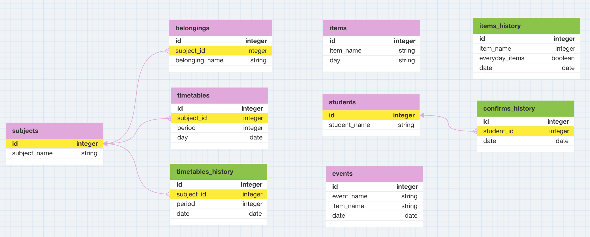

# 本番環境の URL

バックエンドのみ Heroku にデプロイしています。
BaseURL:https://motta-9dbb2df4f6d7.herokuapp.com

# データベース設計



# 開発環境のセットアップ

1. まずは SSH キーをコピーして、あなたの環境にクローンしてください。

```
git clone SSH key
```

2. クローンしたファイルへ移動します。

```
cd Motta_server
```

3. VScode エディタで開きます。

```
code .
```

4. .env ファイルを作成します。

```
touch .env
```

5. .env ファイルに環境変数を設定します。

```
DB_USER=user
DB_PASSWORD=password
DB_NAME=motta
NODE_ENV=development
```

6. 必要なパッケージのインストールを行います。

```
npm install
```

7. データベースを作成します。

```
createdb motta
```

8. マイグレーションファイルを実行し、データベースにテーブルを作成します。

```
npm run migrate
```

9. シードファイルを実行し、テーブルにデータを挿入します。

```
npm run seed
```

10. サーバーを立ち上げます。

```
npm start
```

以上でセットアップは完了です
